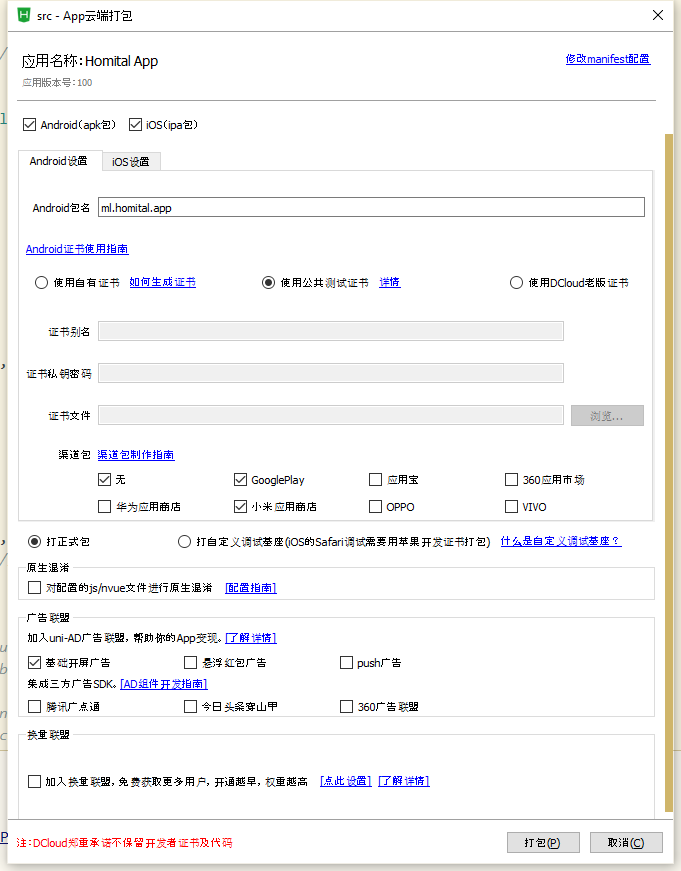
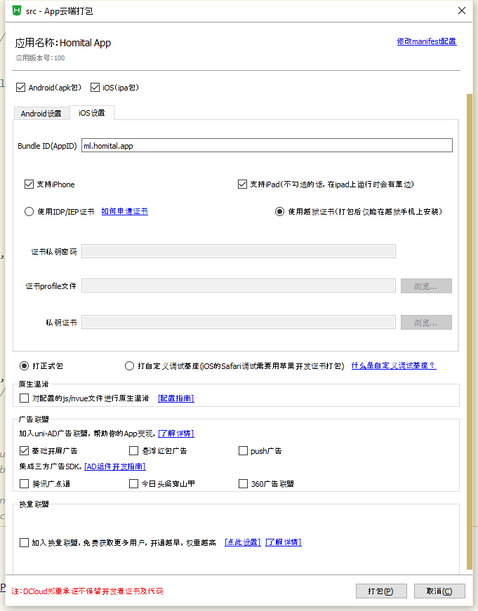

# Homital-App

[GitHub](https://github.com/Homital/Homital-App)

## Project Structure

```homital
.
├── .github (GitHub configuration files)
│   └── ISSUE_TEMPLATE
│   │   └── ...
├── public
│   └── index.html
├── src
│   ├── common (Shared utilities)
│   │   ├── authorisation.js (authorization related functions)
│   │   └── plot_usage.js (dashboard chart functions)
│   ├── components (uni-app components)
│   │   └── ...
│   ├── static (Static files)
│   │   └── ...
│   │ 
│   ├── pages (Hold app pages)
│   │   │── dashboard (Dashboard page)
│   │   │   └── dashboard.vue
│   │   │── devices (Devace related pages)
│   │   │   ├── changeDeviceName.vue
│   │   │   ├── deviceAdd.vue
│   │   │   ├── deviceControl.vue
│   │   │   ├── deviceDetails.vue
│   │   │   └── deviceList.vue
│   │   │── index (Home page)
│   │   │   └── index.vue
│   │   │── login (Login related pages)
│   │   │   ├── forgetPassword.vue
│   │   │   ├── login.vue
│   │   │   ├── register.vue
│   │   │   ├── updatePassword.vue
│   │   │   └── userAgreement.vue
│   │   │── me (User info page)
│   │   │   └── me.vue
│   │   │── rooms (Room related pages)
│   │   │   ├── changeRoomName.vue
│   │   │   ├── roomAdd.vue
│   │   │   ├── roomDetails.vue
│   │   │   └── roomList.vue
│   │   └── user (Room member related pages)
│   │   │   ├── addUser.vue
│   │   │   ├── changeUserRole.vue
│   │   │   └── userDetail.vue
│   │ 
│   ├── App.vue (Configure global style and listeners)
│   ├── main.js (Vue entry file)
│   ├── manifest.json (Configure app name, appid, logo, version, etc)
│   ├── pages.json (Configure routing, nav-bar, etc)
│   └── uni.scss
│ 
├── tests
│   ├── API_tests
│   │   ├── Homital.postman_collection.json (Postman Collection)
│   │   ├── Homital.postman_environment.json (Postman Environment)
│   │   └── Homital.postman_test_run.json (Postman test result)
│   └── unit_tests
│       └── test.js (Mocha test script)
│── .eslintrc.json
│── .gitignore
│── .gitpod.yml
│── .travis.yml
│── babel.config.js
│── README.md
│── package-lock.json
│── package.json
└── tsconfig.json
```

## Setup

1. Install [HBuilderX IDE](https://www.dcloud.io/hbuilderx.html)
1. Clone the GitHub repository: `git clone https://github.com/Homital/Homital-App.git`
1. Open HBuilderX IDE and import this project. Note that there are two ways to import this project into HBuilderX IDE:
   - If you import the root folder, the IDE will use node.js modules within the project folder.
   - If you import only the `/src` subfolder, the IDE will use node.js libraries that come withe the IDE.
1. To build the project as an Android or iOS app, go to `发行(U)`(Release) -> `原生App-云打包`(Native App-Cloud Build) and edit the options as following:




1. After that, the console at the bottom will output the download links to the built packages.

## Continuous Integration

We have set up Travis CI to build H5 version of the app and deploy to <http://www.homital.ml> on push. Edit `.travis.yml` to configure the build process.
