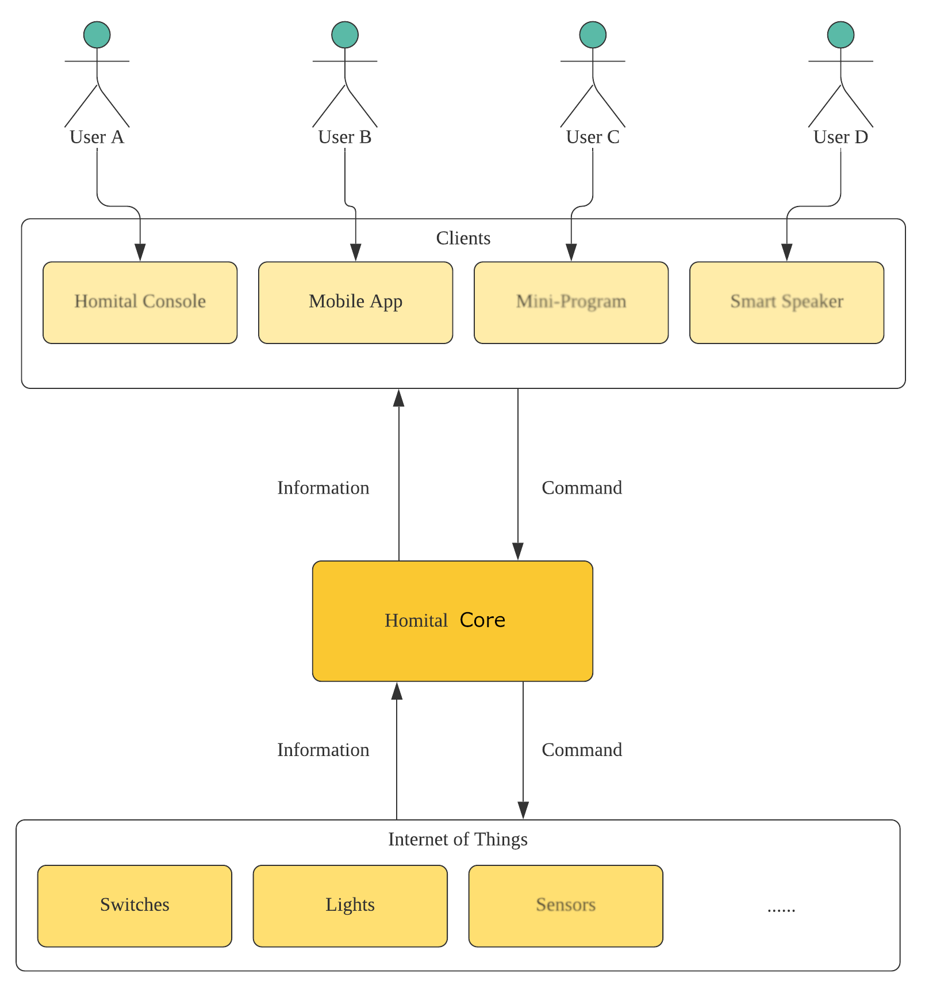

# Developer Guide

Here is the overall architecture of the Homital Project (blurred components are to be implemented in the future):

Currently, the Homital Project is made up of 5 main components:

- [Homital-Core](core)
  - The server-side application
- [Homital-App](app)
  - The cross-platform client app
- [Homital-Light](light)
  - A smart light
- [Homital-USB-Adapter](usb)
  - A smart USB adapter
- [Docs](docs)
  - This documentation

## Project Management

We use [GitHub Kanban board](https://github.com/orgs/Homital/projects/1) to track our progress and manage our issues.

We set milestones for major updates in the softwares.

During each milestone, we first propose new features to our softwares and put them as issues on respective GitHub repositories. We then assign issus to our members and set a deadline for each issue.

Whenever a feature is completed, we start writing tests to verify the correctness of the implementation. During this process, we open bug reports as issues on GitHub and assign developers to the issues.

When there is a need to add new APIs or update existing APIs, our members will hold a meeting to discuss on the interface and complete the API documentation in the OpenAPI Specification 3.0 format. We then write API tests using Postman. Then the developers can work on the server and the client seperately.

Near the end of each milestone, we release the newest stable version of the softwares and update the documentations.
