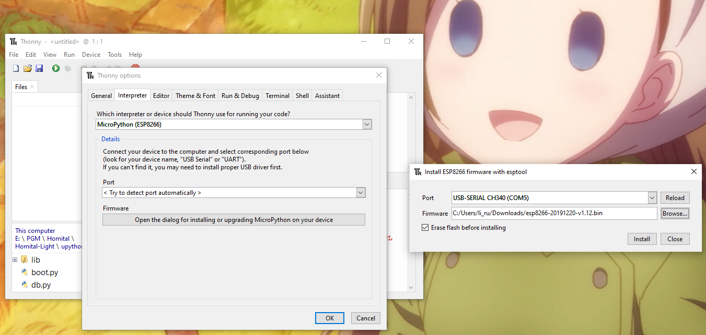
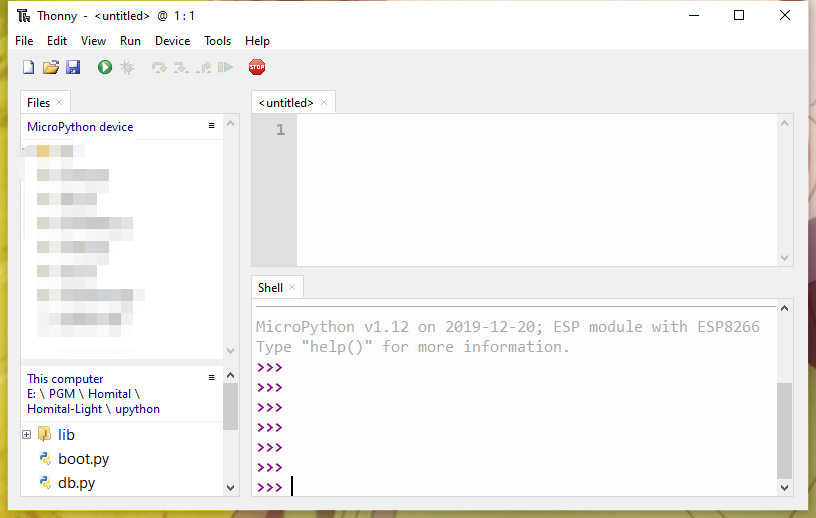
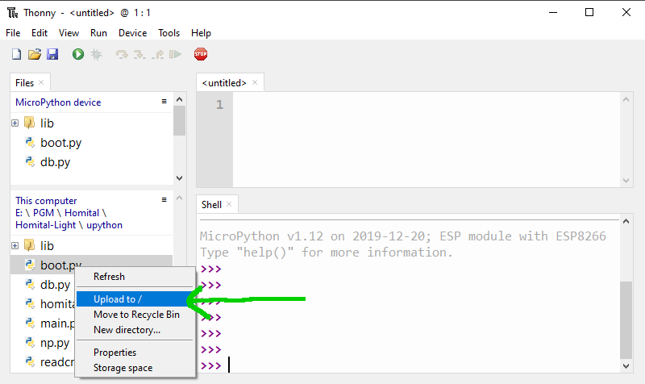
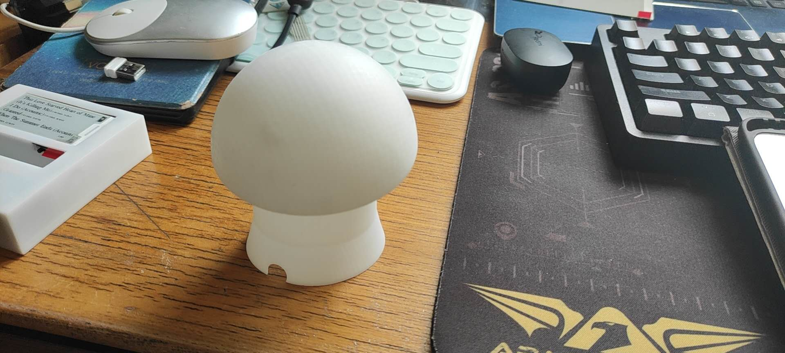

# Homital-Light

[GitHub](https://github.com/Homital/Homital-Light)

Homital-Light is a smart light in the Homital family. It is developed on top of the [ESP8266](https://www.espressif.com/en/products/socs/esp8266/overview) WiFi SoC running [MicroPython](https://micropython.org/). The light source used is a [WS2812B](https://cdn-shop.adafruit.com/datasheets/WS2812B.pdf) LED ring.

## Project Structure

```homital
.
├── 3D Models
│   ├── Base.SLDPRT (the Base as a SolidWorks 2019 Part)
│   ├── Base.STL (3D printable STL model of the base)
│   ├── Head.SLDPRT (3D printable CAD model of the head)
│   └── Head.STL (The Head as a SolidWorks 2019 Part)
│ 
├── upython (MicroPython scripts)
│   ├── lib (Dependencies)
│   │   └── urequests.py (a buggy subset of the CPython requests library)
│   ├── boot.py (the first script getting ran after startup)
│   ├── db.py (local persistent storage functionalities)
│   ├── homital.py (networking utilities)
│   ├── main.py (the script executed right after boot.py)
│   ├── np.py (WS2812B LED functinos)
│   └── readcmd.py (Serial command processing functions)
│ 
│── .gitignore
└── README.md (Project Summary)
```

## Setup

1. Prepare an ESP8266 development board ([the one we use](https://a.aliexpress.com/_dUiLPnV)) and a WS2812B LED ring ([the one we use](https://a.aliexpress.com/_dYrcykT)).
1. Connect the LED ring's VCC wire to your dev-board's VCC pin, GND to GND, and Date-in to Pin 0 on the dev-board.
1. Clone the Git repository: `git clone https://github.com/Homital/Homital-Light.git`.
1. Connect The ESP8266 development board to your PC via a USB-TTL converter or FTDI adapter. If your dev board already has the chip soldered on it, simply use a USB cable.
1. Download the latest MicroPython firmware from [here](http://micropython.org/download/esp8266/).
1. Install [Thonny Python IDE](https://thonny.org/)
1. Open Thonny IDE, go to `Tools` -> `Options` -> `Interpreter` and select MicroPython(ESP8266) from the dropdown menu. Click on the button under `Firmware`, choose your Port and the firmware you just downloaded and click on install.



8. Once the firmware has benn uploaded, close the dialog and you should see a Python shell at the bottom of Thonny window.



9. Then you can open the `/upython` folder in the Files panel of Thonny at the bottom left, and upload all files and directories to the dev-board, as shown below.



10. Now you have given birth to a new Homital-Light! Reset the devboard and you are ready to go. To configure the device to work with the Homital system, refer to [User Guide](/user-guide/#homital-smart-device-configuration).

## 3D Printed Case

We have prepared a 3D printable model for Homital-Light. Below are the two STL files needed.

<div class="render-wrapper">
<iframe src="https://render.githubusercontent.com/view/solid?color_mode=light&commit=910c6c8719e12175b700bbecff75b1030a503f6a&enc_url=68747470733a2f2f7261772e67697468756275736572636f6e74656e742e636f6d2f486f6d6974616c2f486f6d6974616c2d4c696768742f393130633663383731396531323137356237303062626563666637356231303330613530336636612f33442532304d6f64656c732f426173652e53544c&nwo=Homital%2FHomital-Light&path=3D+Models%2FBase.STL&repository_id=266380158&repository_type=Repository#24b10d0a-13ed-4137-9668-47d4c008ffe7" title="Base.stl"></iframe>
</div>

<div class="render-wrapper">
<iframe src="https://render.githubusercontent.com/view/solid?color_mode=light&commit=910c6c8719e12175b700bbecff75b1030a503f6a&enc_url=68747470733a2f2f7261772e67697468756275736572636f6e74656e742e636f6d2f486f6d6974616c2f486f6d6974616c2d4c696768742f393130633663383731396531323137356237303062626563666637356231303330613530336636612f33442532304d6f64656c732f486561642e53544c&nwo=Homital%2FHomital-Light&path=3D+Models%2FHead.STL&repository_id=266380158&repository_type=Repository#a280e2c7-cd4d-4bed-9feb-c44ca48d7a58" title="Base.stl"></iframe>
</div>

It is recommanded to print the models using a SLA printer because the models are not optimized for FDM printing. A finished print is shown below:


